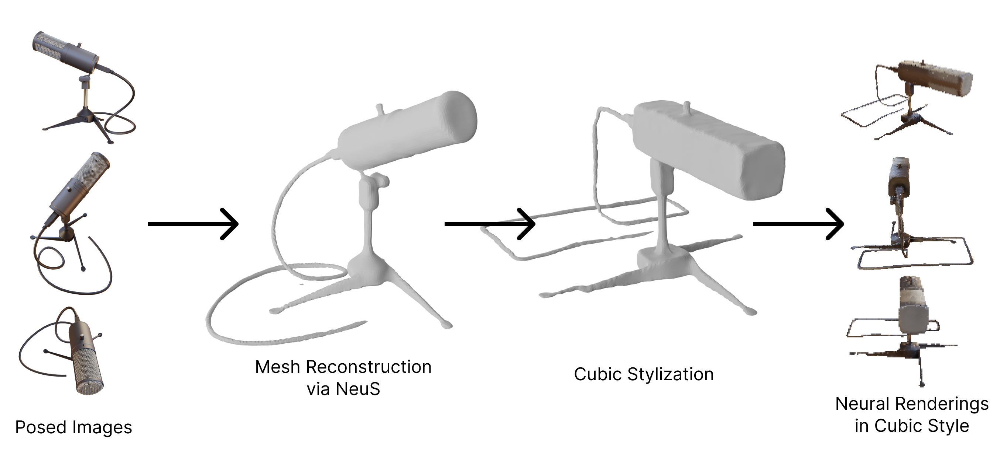
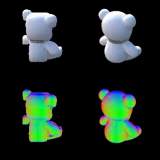

# NeuStyle

An overview of our method is shown above. A sample rendering is shown below.

The above sample uses a [teddy bear mesh by hectopod](https://sketchfab.com/3d-models/teddy-bears-e84b12b4ac20402aaf4d40f2219cd0e2), which is licensed under [CC BY 4.0](https://creativecommons.org/licenses/by/4.0/).
